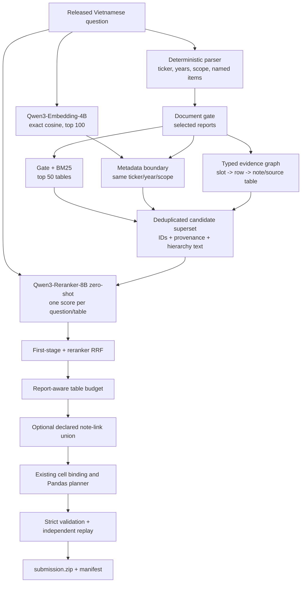

# Final stretch: Qwen dense retrieval, reranking, and submission

Date: 2026-08-25

## 1. Objective

Raise table F2 without destabilising the document gate, answer code, or package
reproducibility. The first shipping path uses the completed Qwen3 dense index
and the official Qwen3 reranker zero-shot. Fine-tuning is a later, separately
gated treatment because the current adapter is rejected.

The public reference is the note-link package:

| metric | value |
|---|---:|
| Tables F2 | 0.5299 |
| Tables precision | 0.3466 |
| Tables recall | 0.6270 |
| mean submitted tables | 6.1136 |
| Documents F2 | 0.9711 |

The immediate research question is:

> Does same-ticker/year/scope Qwen3 dense retrieval add useful candidates to
> gated BM25, and can one zero-shot Qwen3 reranker place those candidates inside
> the existing report-aware table budget?

This is a ranking experiment. It does not change question parsing, report
selection, table extraction, answer planning, or execution.

## 2. Decisions already made

1. **Keep the document gate.** Its public F2 is 0.9711. Dense retrieval does not
   get permission to search arbitrary companies, years, or scopes.
2. **Use `dense-policy=same-triple`.** The completed label-free audit of the
   unrestricted dense top 100 found:

   | location | share |
   |---|---:|
   | inside the selected reports | 0.375 |
   | right issuer/year, wrong scope | 0.319 |
   | other issuer, right year | 0.178 |
   | right issuer, other year | 0.115 |
   | unrelated issuer and year | 0.009 |
   | right issuer/year/scope, alternate file | 0.004 |

   Unrestricted dense is therefore a document-retrieval mutation dominated by
   wrong-scope candidates. `same-triple` retains only the useful ambiguity:
   alternate files for the same ticker, year, and scope.
3. **Use hybrid retrieval, not dense replacement.** Vietnamese account names,
   codes, tickers, years, and exact OCR strings suit BM25; paraphrases and label
   variants suit embeddings. RRF keeps both without calibrating incomparable
   score scales.
4. **Use the reranker as another rank, not a replacement.** Previous replacement
   rules lost. Equal reciprocal-rank fusion bounds damage from a wrong model.
5. **Keep the current report-aware budget.** Fixed caps and previous coverage
   filters lost. The default remains `min(30, 2 * selected_reports)`.
6. **Graph edges only generate candidates.** The graph is the deterministic
   path `slot -> source row -> source/note table`. It never creates financial
   facts and never overrides the reranker or budget.
7. **Do not use the current LoRA.** It changed validation top-1 from 0.9150 to
   0.3450 after 2,400 steps. It is archived evidence, not a checkpoint.
8. **No parameter sweep on the public set.** One candidate pool, one score file,
   three derived arms, one variable between adjacent submissions.

## 3. Target architecture



This is not global GraphRAG. There is no entity extraction model, community
detection, vector database, or unbounded traversal. The corpus already exposes
the useful relation in a statement row's `Thuyết minh` column, so the graph is
small, typed, exact, and auditable.

## 4. Stage contracts

### A. Question and document gate

Input: `{id, question}`.

Output:

- parsed ticker(s), requested year(s), and report scope;
- selected report IDs;
- named line items used only for deterministic graph paths.

Invariant: the sparse lane is unchanged from the current system. Dense candidates
may come only from report files sharing a selected report's ticker, year, and
canonical scope.

### B. Sparse candidate lane

- Current `report-coverage` retrieval.
- Depth 50 per question.
- Candidate text uses the hierarchy representation: filing identity, section
  path, column path, selected row, unit, and a compact line-item inventory.
- Every candidate receives `sparse_rank`; no dense rank is invented.

### C. Dense candidate lane

- Model: `Qwen/Qwen3-Embedding-4B`.
- Revision: `5cf2132abc99cad020ac570b19d031efec650f2b`.
- Query instruction: the pinned Vietnamese financial-table retrieval
  instruction in `kaggle/embed_tables.py`.
- Passage length: 256 tokens.
- Pooling: final-token pooling with an explicit EOS token.
- Representation: first 1,024 Matryoshka dimensions, then L2 normalisation.
- Search: exact dot product; 130,556 by 1,024 fits in memory and needs no ANN.
- Initial depth: 40 inside the `same-triple` metadata boundary.
- Extension depth: 100 only after the depth-40 hybrid arm beats sparse. The
  extension reuses the first score file through `SKIP_PATH`, so only newly
  introduced candidates are scored.

The existing index is complete and numerically healthy:

| artifact | shape / count | SHA-256 |
|---|---:|---|
| `table_vectors.npy` | 130,556 x 1,024 fp16 | `badcfd2a9ce57eb83d2bf63774ec3f9f09a01af367b11c4f64073a9927349446` |
| `question_vectors.npy` | 1,012 x 1,024 fp16 | `4ee3f964ff80d2f720b45dc46d0e84cd3a0ed9b7466eb7f3c6e166838b189e1a` |
| `table_ids.json` | 130,556 unique IDs | `ce17fb27f7843084f636286713b294893b0560840523486b7bbd30df020290ec` |
| `question_ids.json` | 1,012 unique IDs | `756e34bcb881f5b3b0abc73ede8fd5f0500f964fcb30c8f13a29df08b3230c5e` |

Before shipping, write a manifest tying these hashes to the model revision,
instruction, source corpus hash, table-renderer version, and question-file hash.
If that provenance cannot be reconstructed, rebuild the index rather than claim
an unverifiable checkpoint.

### D. Hybrid candidate union

Merge by `table_id`:

- sparse-only candidates retain `sparse_rank` only;
- dense-only candidates retain `dense_rank` only;
- overlaps retain both ranks;
- candidate text is rendered identically regardless of retrieval lane;
- dense and sparse scores are never directly averaged.

The hybrid first-stage score is:

```text
1 / (60 + sparse_rank) + 1 / (60 + dense_rank)
```

Missing ranks contribute zero. Agreement receives a natural bonus.

### E. Typed graph augmentation

Use the existing graph only after the sparse+dense pool exists:

```text
EvidenceSlot(report, line item)
    -> RowAnchor(table, row, label, code, note)
    -> SOURCE_TABLE or NOTE_REF(table)
```

Rules:

- same report only;
- exact row-label anchor, not whole-table substring matching;
- at most three paths per question;
- cover distinct evidence slots before taking a second path for one slot;
- append candidates to the scoring pool; never append them directly to the
  submitted set;
- preserve the complete trace showing slot, row, note number, and target table.

`SOURCE_TABLE` will usually deduplicate against sparse/dense. `NOTE_REF` is the
main source of genuinely new candidates.

### F. Qwen reranker

- Model: `Qwen/Qwen3-Reranker-8B`.
- Revision: `77d193c791ed757ca307ee72715aa132723da912`.
- Initial treatment: zero-shot fp16, no adapter.
- Input: the full original question and one hierarchy-rendered candidate.
- Maximum sequence length: 1,024.
- Score: probability of `yes` versus `no` at the final token.
- All candidate arms are scored in one combined run.
- The run is resumable by question and by already-scored table.
- Validate exact candidate coverage, finite scores, duplicate absence, and
  model/prompt hashes before applying scores.

Expected initial pool: roughly 70,000-90,000 pairs for sparse top 50 plus dense
top 40 and graph candidates. The scorer uses each candidate's own sparse/dense
rank, so every initial candidate is eligible. If dense wins, extending to dense
top 100 produces roughly 130,000-155,000 total pairs, but `SKIP_PATH` prevents
the first 70,000-90,000 from being scored again.

### G. Final ranking and budget

For every arm, fuse first-stage rank and model rank with equal RRF weight. Do
not sweep the weight; `0.5` is the preregistered value and historical weight
differences are inside measurement noise.

Primary budget:

```text
min(30, 2 * selected_report_count)
```

After a winning reranked arm is identified, one final treatment may append up
to three declared note tables behind that already-truncated budget. The note
link is additive and has already produced the current public improvement.

### H. Existing answer and execution path

The selected tables are materialised as source-derived CSV subsets. Existing
cell binding and Pandas planning consume only those CSVs. No retrieval component
may store an answer, computed value, or hidden evidence.

The table owner and answer owner remain separate. Retrieval changes must report
how many answers and Pandas queries changed, but this phase does not modify
`src/vifinqa/answers.py`.

## 5. Small missing glue before the GPU run

Only four focused changes are permitted:

1. Fix `scripts/evaluate_benchmark_fidelity.py` to average question-level F2,
   rather than computing F2 from average precision and recall.
2. Add a dense-artifact verifier/manifest writer. It validates shapes, dtypes,
   unique aligned IDs, finite vectors, norms, source hashes, model revision, and
   embedding configuration.
3. Add a sidecar merger for dense, graph, and note table-to-report maps. It must
   reject conflicting report IDs instead of allowing last-write-wins.
4. Correct `scripts/add_note_links.py` to operate on the budgeted prefix:
   initialise `seen` from `order[:budget]`, follow links only from that prefix,
   and then append links. A note sitting below the budget in a full ranking must
   not prevent the same note from being appended to the selected prefix.

No new framework, service, vector database, configuration system, or model
wrapper is needed.

## 6. Canonical build sequence

Use a new immutable output directory; never overwrite previous scores or
packages.

The canonical local entrypoint runs this complete CPU block and refuses to
overwrite a non-empty directory:

```bash
scripts/build_final_candidates.sh output/final_YYYYMMDD_run1
```

The expanded commands below document exactly what that entrypoint executes.

```bash
FINAL_DIR=output/final_20260825

.venv/bin/python -m pytest tests -q

.venv/bin/python scripts/verify_dense_artifacts.py \
  --dense output/dense \
  --tables output/dense/tables.jsonl \
  --questions data/raw/vifinqa/questions/questions.jsonl \
  --manifest "$FINAL_DIR/dense_manifest.json"

.venv/bin/python scripts/export_rerank_pairs.py \
  --depth 50 \
  --dense output/dense \
  --dense-depth 40 \
  --dense-policy same-triple \
  --hierarchy \
  --output "$FINAL_DIR/pairs_hybrid.jsonl" \
  --dense-tables "$FINAL_DIR/dense_tables.json" \
  --progress-every 100

.venv/bin/python scripts/apply_rerank_scores.py \
  --pairs "$FINAL_DIR/pairs_hybrid.jsonl" \
  --first-stage-only --arm hybrid \
  --output "$FINAL_DIR/ranking_hybrid_first_stage.json"

.venv/bin/python scripts/add_graph_tables.py \
  --pairs "$FINAL_DIR/pairs_hybrid.jsonl" \
  --base-ranking "$FINAL_DIR/ranking_hybrid_first_stage.json" \
  --arm hybrid --depth 30 --max-added 3 --hierarchy \
  --output "$FINAL_DIR/ranking_graph_candidates.json" \
  --trace "$FINAL_DIR/graph.trace.jsonl" \
  --expanded-pairs "$FINAL_DIR/pairs_hybrid_graph.jsonl"

.venv/bin/python scripts/merge_table_sidecars.py \
  --input "$FINAL_DIR/dense_tables.json" \
  --input "$FINAL_DIR/ranking_graph_candidates.graph_tables.json" \
  --output "$FINAL_DIR/extra_tables.json"

.venv/bin/python scripts/validate_rerank_pairs.py \
  --pairs "$FINAL_DIR/pairs_hybrid_graph.jsonl" \
  --extra-tables "$FINAL_DIR/extra_tables.json" \
  --graph-trace "$FINAL_DIR/graph.trace.jsonl" \
  --dense-manifest "$FINAL_DIR/dense_manifest.json" \
  --manifest "$FINAL_DIR/candidate_manifest.json"
```

Upload `pairs_hybrid_graph.jsonl` to Kaggle and score it once. The preferred
T4 configuration depends on whether the notebook exposes one or two cards:

- **T4 x2:** `Qwen3-Reranker-8B`, `QUANTIZATION="fp16"`, model-parallel through
  `device_map="auto"`;
- **one T4:** `Qwen3-Reranker-8B`, `QUANTIZATION="int8"`, resumable across
  sessions;
- **one-session fallback on one T4:** `Qwen3-Reranker-4B` in fp16. This is
  faster but is not silently interchangeable with 8B; it is a separate model
  arm and historically ranks below 8B.

Run a 500-1,000-pair smoke shard first. Check that scores are finite, GPU memory
is stable, and the printed throughput supports the session plan before starting
the complete file. The smoke output is diagnostic only: every submission must
be derived from scores covering the full 71,975-pair file.

```bash
python kaggle/rerank_qwen_8b.py \
  "$FINAL_DIR/pairs_hybrid_graph.jsonl" \
  "$FINAL_DIR/scores_qwen3_8b_zero_shot.jsonl"
```

Then validate before using the result:

```bash
.venv/bin/python scripts/validate_rerank_scores.py \
  --pairs "$FINAL_DIR/pairs_hybrid_graph.jsonl" \
  --scores "$FINAL_DIR/scores_qwen3_8b_zero_shot.jsonl" \
  --manifest "$FINAL_DIR/scores_qwen3_8b_zero_shot.jsonl.manifest.json"
```

For a resumable one-T4 run, repeat both `--scores` and `--manifest` once per
shard in matching order. Validation rejects missing candidates or shards whose
model, revision, quantisation, prompt, or pair hash differs.

Derive all rankings from that one score file:

```bash
.venv/bin/python scripts/apply_rerank_scores.py \
  --pairs "$FINAL_DIR/pairs_hybrid.jsonl" \
  --scores "$FINAL_DIR/scores_qwen3_8b_zero_shot.jsonl" \
  --arm sparse --weight 0.5 \
  --output "$FINAL_DIR/ranking_sparse_qwen.json"

.venv/bin/python scripts/apply_rerank_scores.py \
  --pairs "$FINAL_DIR/pairs_hybrid.jsonl" \
  --scores "$FINAL_DIR/scores_qwen3_8b_zero_shot.jsonl" \
  --arm hybrid --weight 0.5 \
  --output "$FINAL_DIR/ranking_hybrid_qwen.json"

.venv/bin/python scripts/apply_rerank_scores.py \
  --pairs "$FINAL_DIR/pairs_hybrid_graph.jsonl" \
  --scores "$FINAL_DIR/scores_qwen3_8b_zero_shot.jsonl" \
  --arm hybrid --weight 0.5 \
  --output "$FINAL_DIR/ranking_hybrid_graph_qwen.json"
```

Merge sidecars once, then build packages with the default report-aware budget:

```bash
.venv/bin/python scripts/merge_table_sidecars.py \
  --input "$FINAL_DIR/dense_tables.json" \
  --input "$FINAL_DIR/ranking_graph_candidates.graph_tables.json" \
  --output "$FINAL_DIR/extra_tables.json"

for arm in sparse_qwen hybrid_qwen hybrid_graph_qwen; do
  .venv/bin/python run.py \
    --ranking "$FINAL_DIR/ranking_${arm}.json" \
    --extra-tables "$FINAL_DIR/extra_tables.json" \
    --rerank-depth 50 \
    --output-dir "$FINAL_DIR/submission_${arm}" \
    --progress-every 200
done
```

Finally, apply note linking to the winning reranked arm, merge its note sidecar,
and build it with `--table-top-k ranking` because that ranking carries its own
budget.

## 7. Submission ladder

Do not submit dense-only or unrestricted-dense packages. Submit in this order:

| arm | one changed variable | purpose |
|---|---|---|
| ZS-S | current sparse candidates + fresh zero-shot Qwen | clean reranker value |
| ZS-H | add same-triple dense candidates, same score run | dense contribution |
| ZS-HG | add typed graph candidates, same score run | graph contribution |
| WIN-N | winning arm + declared note-link append | retain the proven recall edge |

Decision rules:

- If ZS-S does not beat 0.5299, stop adding mechanisms and diagnose the fresh
  reranker representation/scoring path.
- If ZS-H loses to ZS-S, dense remains a diagnostic index and does not ship.
- If depth-40 ZS-H beats ZS-S materially, export dense depth 100 and score only
  the new candidates with the completed depth-40 score file as `SKIP_PATH`.
  This is a conditional recall extension, not a public depth sweep.
- If ZS-HG loses to its non-graph parent, graph remains provenance/explanation
  only and does not ship.
- WIN-N is the final public package only if note linking remains positive on the
  new reranked base.
- A public delta below 0.01 is weak evidence; prefer mechanism-consistent gains
  and the private-round risk profile over tiny rank changes.

## 8. Validation gates

### Before GPU scoring

- 1,012 question records, unique and ordered;
- 130,556 aligned unique table IDs and vectors;
- no NaN/Inf; sampled vector norms within `[0.99, 1.01]`;
- every dense candidate satisfies `same-triple`;
- no duplicate candidate table within a question;
- every graph target resolves to the raw report and has a trace;
- candidate and prompt hashes recorded.

### After GPU scoring

- every eligible candidate has exactly one finite score;
- no unknown question/table IDs;
- model name, revision, dtype, quantisation, prompt hash, pair hash, elapsed
  time, and GPU name recorded;
- all three rankings derive from the same score hash;
- no ranking is empty;
- sparse arm candidate membership matches the sparse portion of the combined
  pool exactly.

### Every package

```bash
.venv/bin/python scripts/validate_submission.py "$PACKAGE/package"
.venv/bin/python scripts/verify_execution.py --package "$PACKAGE/package"
.venv/bin/python scripts/compare_table_packages.py \
  output/submission_notelink/package "$PACKAGE/package"
```

Required:

- validator reports `VALID`;
- 1,012 questions;
- zero execution exceptions and zero replay disagreements;
- no table outside its declared document;
- no duplicate table IDs or CSV paths;
- all CSVs trace to organizer source tables;
- document changes, table additions/removals, answer changes, and query changes
  are printed, never hidden;
- final zip and every input artifact receive SHA-256 hashes.

The internal 233-question labels may reject obvious harm, but they cannot choose
between close arms. They were discovered from an earlier retriever and rank
close public systems backwards.

## 9. Fine-tuning later, not in the first submission run

The existing adapter is rejected and must never be uploaded or described as a
usable model. A future fine-tune begins only after the zero-shot architecture
has a public winner.

Required repairs:

1. Preserve every checkpoint instead of overwriting one adapter directory.
2. Evaluate before training and at least every 100-250 steps; stop immediately
   when report-disjoint validation declines.
3. Keep all positive tables for a question. The current training path samples
   one positive, which can teach the model that another required evidence table
   is negative by omission.
4. Reduce the `1e-4` learning rate and run a short learning-curve smoke test
   before a multi-hour job.
5. Draw hard negatives from the exact winning sparse+dense candidate policy.
6. Compare zero-shot and LoRA on identical held-out candidates and then score
   both in one GPU session.
7. Promote the adapter only if it beats zero-shot before any leaderboard slot
   is spent.

Fine-tuning is an optimisation of the proven architecture, not a prerequisite
for it.

## 10. Time and compute: T4 only

The expensive dense embedding stage is already finished.

| work | expected wall time |
|---|---:|
| glue fixes, tests, manifests | 1-2 hours |
| full sparse+dense hierarchy export | 45-75 minutes CPU |
| graph candidate expansion | 30-60 minutes CPU |
| initial scoring, roughly 70k-90k pairs, T4 x2 with 8B fp16 | approximately 8-12 hours; smoke-test the real rate |
| initial scoring, one T4 with 8B int8 | approximately 30-40 hours over resumable sessions |
| initial scoring, one T4 with 4B fp16 fallback | approximately 8-12 hours |
| rankings, three packages, validation, replay | 1-2 hours |
| optional dense 41-100 extension | score only new candidates after depth 40 wins |

Kaggle's 12-hour session wall makes resumability a release requirement. Download
the partial score file after every session, attach it to the next notebook as
`RESUME_PATH`, and write new progress to a fresh `SCORES_PATH`. Validate and
merge all shards locally. Never restart a completed question and never compare
arms scored in unrelated candidate batches when using int8, because
bitsandbytes scoring is batch-sensitive.

## 11. Explicitly deferred

- unrestricted dense retrieval;
- dense-only public submission;
- coverage filtering or a new table cap;
- LLM query decomposition before retrieval;
- global/community GraphRAG;
- Qdrant or another vector database;
- the failed LoRA adapter;
- public weight/depth sweeps;
- changes to answer planning owned by the other workstream.

These can be revisited only after the sparse/dense/reranked ladder establishes
which retrieval stage is actually buying points.
